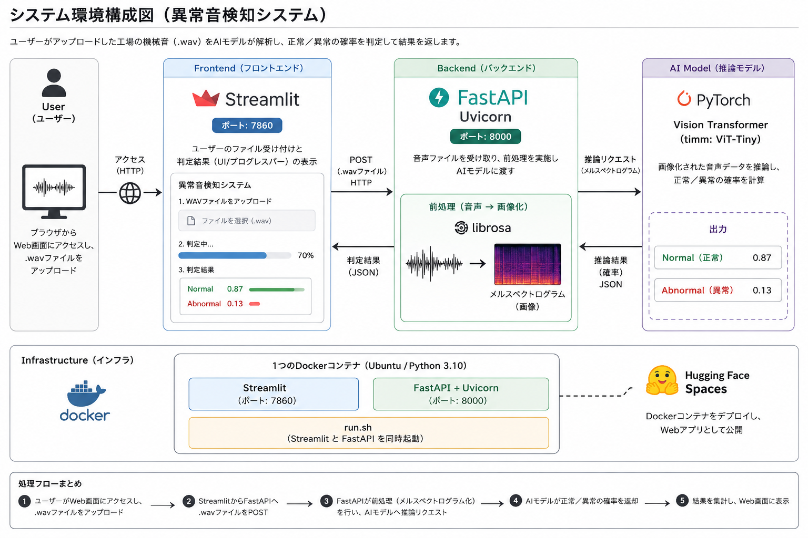

# Factory Anomaly Detection - Integrated Audio Analysis & AI Factory Monitoring System

Factory Anomaly Detection は、MIMII Dataset（バルブ音響データ）を活用した、工場管理者・設備保全エンジニア向けの次世代機械音響解析・異常検知プラットフォームです。

AIによる自動判定、高精度なメルスペクトログラム可視化、そしてマルチマシンのバルク評価機能を、セキュアなDockerコンテナ環境で実現しました。

🔗 [https://masaroo-factory-anomaly-detection.hf.space/](https://masaroo-factory-anomaly-detection.hf.space/)

---

## テスト用サンプルデータ

リポジトリ内の `test_data/` ディレクトリに、正常100通り、異常150通りの計250サンプルを同梱しています。

---

# 📂 ディレクトリ構成 (Project Structure)

```plaintext
.
├── test_data/                        # 評価用WAVサンプルデータ (計250ファイル)
│   ├── normal/                       # id_00, 02, 04, 06 からランダム抽出した正常音
│   └── abnormal/                     # id_00, 02, 04, 06 からランダム抽出した異常音
│
├── architecture.png                  # システム環境構成図
├── mimii_transformer.py              # mimiiデータセット取得&特徴量変換&Transformer学習
├── app.py                            # FastAPI AI Service (推論 & 前処理バックエンド)
├── ui.py                             # Streamlit Frontend (WebUIフロントエンド)
├── vit_anomaly_detection.pth         # 学習済み Vision Transformer (ViT-Tiny) モデル重み
│
├── Dockerfile                        # Linux(Debian)ベースのマルチサービスコンテナ設計図
├── run.sh                            # FastAPI & Streamlit 同時起動用シェルスクリプト
├── requirements.txt                  # Python依存ライブラリ指定 (バージョン固定含む)
├── .gitignore                        # Git追跡対象外設定ファイル
└── README.md                         # 本ドキュメント
```

---

# 🏗️ システム環境構成 (Architecture)

本番環境は、高可用性とポータビリティを両立したDockerコンテナ構成を採用し、Hugging Face Spaces上で稼働しています。



---

# 🚀 主要機能 (Key Features)

## 1. インテリジェント・サウンド・アナリティクス

### ワンクリック判定
音声ファイルをアップロードするだけで、バックエンドのAIが即座に工場の機械状態を診断します。

### 確信度のリアルタイム可視化
AIがどれだけの確率で「正常」または「異常」と判断したかを、プログレスバーによって直感的に把握できます。

---

## 2. 包括的マルチマシン管理・評価システム

### クロスID評価対応
`id_00`、`id_02`、`id_04`、`id_06` の異なる複数マシンの固有音に対して、モデルが普遍的な異常を検知できるかバルク（一括）テストが可能です。

### トレーサビリティの確保
抽出データにマシンIDを自動付与し、どの個体の音響データであるかを明確に識別できます。

---

## 3. インタラクティブ音響解析・可視化

### オーディオプレビュー
アップロードした機械音（WAV形式）を、内蔵プレイヤーによりWebブラウザ上でその場で再生・確認できます。

### メルスペクトログラム変換
`librosa` を用いて音声バイナリから短時間フーリエ変換（STFT）を行い、AIモデルに最適な画像特徴量へとオンザフライで前処理します。

---

## 4. プロフェッショナルAIアーキテクチャ

### モダンな Lifespan ハンドリング
FastAPIの最新仕様に準拠し、非推奨の `on_event` ではなく `lifespan` コンテキストマネージャによる安全なモデル読み込み・リソース管理を実現しています。

### 軽量コンテナ設計
`torchvision` や `torchaudio` との内部整合性を担保しつつ、CPU環境に最適化した軽量なプロダクション環境を構築しています。

---

# 📦 セットアップ手順 (Local Setup)

## バックエンド & フロントエンド共通（Conda仮想環境）

互換性と安定性を重視した Python 3.10 環境を作成し、依存関係をインストールします。

```bash
conda create -n ml_api python=3.10 -y
conda activate ml_api
pip install -r requirements.txt
```

---

## バックエンド (FastAPI) の起動

推論APIサーバーをローカルの8000番ポートで起動します。

```bash
uvicorn app:app --reload --port 8000
```

起動後、以下にアクセスすることで Swagger UI から直接APIの対話型テストが可能です。

```text
http://127.0.0.1:8000/docs
```

---

## フロントエンド (Streamlit) の起動

別のターミナルを開き、WebUIサーバーを起動します。

```bash
streamlit run ui.py
```

起動後、自動的にブラウザが立ち上がり、以下でダッシュボードが利用可能になります。

```text
http://localhost:8501
```

---

# 📧 Contact

開発者へのフィードバックやお問い合わせは、GitHub Issues までお願いします。

---

© 2026 Factory Anomaly Detection System. Created for Academic Purposes.

---

# ⚖️ ライセンス / OSS・データセット表記

## プロジェクトライセンス

本プロジェクトは MIT License のもとで公開されています。

詳細は `LICENSE` ファイルを参照してください。

---

## 利用データセット

本システムでは、株式会社日立製作所が提供する実世界の工場音を模した異常検知用データセット

**MIMII Dataset (Malfunctioning Industrial Machine Investigation and Inspection)**

から、Valve（バルブ）の音響データを研究・学習用途で利用しています。

| 項目 | 内容 |
|--------|--------|
| Dataset | MIMII Dataset (Valve) |
| Provider | Hitachi, Ltd. |
| URL | https://zenodo.org/record/3384388 |

---

## 使用OSSライブラリ

本システムでは以下を含むOSSライブラリを利用しています。

- PyTorch
- timm
- librosa
- FastAPI
- Streamlit
- uvicorn

各ライブラリのライセンス条件に従って利用しています。

詳細な依存関係ライセンスは `requirements.txt` を参照してください。
